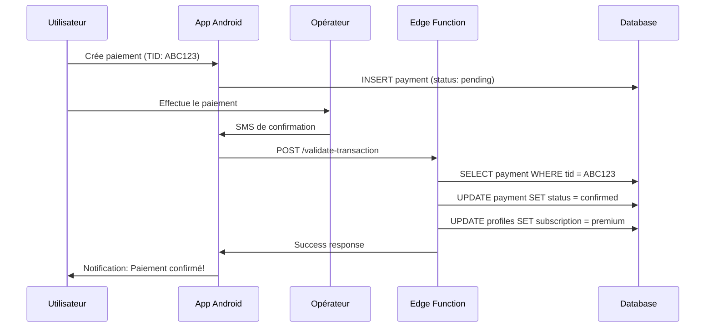

# 📱 Edge Function: validate-transaction

**Date** : 5 janvier 2025  
**Fonction** : Validation automatique des transactions via SMS  
**Opérateurs** : Airtel Money, Moov Money, Libertis

---

## 🎯 Objectif

Cette Edge Function permet de valider automatiquement les paiements Mobile Money en analysant les SMS de confirmation reçus sur Android.

**Flux** :
```
Android → SMS reçu → App Android → Edge Function → Validation automatique
```

---

## 📋 Configuration

### 1. Variables d'Environnement

Dans Supabase Dashboard → Edge Functions → Secrets :

```bash
SMS_SECRET_KEY=votre-cle-secrete-ultra-securisee-ici
SUPABASE_URL=https://votre-projet.supabase.co
SUPABASE_SERVICE_ROLE_KEY=votre-service-role-key
```

### 2. Déployer la Fonction

```bash
supabase functions deploy validate-transaction
```

### 3. URL de la Fonction

```
https://votre-projet.supabase.co/functions/v1/validate-transaction
```

---

## 🔐 Sécurité

### Clé Secrète Requise

Tous les appels doivent inclure le header :

```http
x-secret-key: votre-cle-secrete
```

⚠️ **IMPORTANT** : Ne jamais exposer cette clé dans le code client !

### Recommandations

1. Générer une clé secrète forte (32+ caractères)
2. La stocker uniquement dans l'app Android (cryptée)
3. Changer la clé régulièrement
4. Logger tous les accès

---

## 📥 Format de Requête

### Endpoint

```
POST https://votre-projet.supabase.co/functions/v1/validate-transaction
```

### Headers

```http
Content-Type: application/json
x-secret-key: votre-cle-secrete
```

### Body

```json
{
  "message": "Votre paiement de 5000 FCFA a ete confirme. TID: ABC123456789. Merci.",
  "from": "AirtelMoney"
}
```

---

## 📤 Format de Réponse

### Succès (200)

```json
{
  "success": true,
  "payment_id": "uuid-du-paiement",
  "user_id": "uuid-de-l-utilisateur",
  "amount": 5000,
  "tid": "ABC123456789",
  "operator": "airtel",
  "subscription": {
    "subscriptionType": "premium",
    "expiresAt": "2025-02-05T10:30:00.000Z"
  }
}
```

### Erreur 401 (Non autorisé)

```json
{
  "success": false,
  "error": "Unauthorized: Invalid secret key"
}
```

### Erreur 404 (Paiement non trouvé)

```json
{
  "success": false,
  "error": "No pending payment found with this TID",
  "tid": "ABC123456789"
}
```

### Erreur 400 (TID non extrait)

```json
{
  "success": false,
  "error": "Could not extract transaction information from SMS",
  "details": {
    "operator_detected": "airtel",
    "tid_found": false
  }
}
```

---

## 📱 Exemples de SMS

### Airtel Money

```
Paiement réussi !
Montant : 5000 FCFA
TID: AMP1234567890
Date : 05/01/2025 10:30
Merci d'utiliser Airtel Money
```

**TID extrait** : `AMP1234567890`  
**Opérateur** : `airtel`

---

```
Your payment of 5000 CFA has been confirmed.
Transaction ID: AIRT987654321
Thank you.
```

**TID extrait** : `AIRT987654321`  
**Opérateur** : `airtel`

---

### Moov Money

```
Paiement confirmé
Montant: 5000 FCFA
Ref: MOV1234567890
Date: 05/01/2025
Service: WordCraft
```

**TID extrait** : `MOV1234567890`  
**Opérateur** : `moov`

---

```
Transaction réussie
5000 F CFA
Reference: MOOV123ABC456
Merci de votre confiance
```

**TID extrait** : `MOOV123ABC456`  
**Opérateur** : `moov`

---

### Libertis (Moov)

```
Libertis Money
Paiement: 5000 FCFA
Ref: LIB9876543210
Merci!
```

**TID extrait** : `LIB9876543210`  
**Opérateur** : `moov`

---

## 🔍 Regex Utilisées

### Airtel Money

```typescript
/TID[:\s]+([A-Z0-9]{10,})/i
/Transaction\s+ID[:\s]+([A-Z0-9]{10,})/i
/Code[:\s]+([A-Z0-9]{10,})/i
```

### Moov Money / Libertis

```typescript
/Ref[:\s]+([A-Z0-9]{10,})/i
/Reference[:\s]+([A-Z0-9]{10,})/i
/Transaction[:\s]+([A-Z0-9]{10,})/i
```

### Montant

```typescript
/(\d+(?:\s?\d+)*)\s*(?:FCFA|CFA|F\s*CFA)/i
/Montant[:\s]+(\d+(?:\s?\d+)*)/i
```

---

## 🔄 Logique de Traitement

### Étape 1 : Réception du SMS

```typescript
{
  "message": "...",
  "from": "AirtelMoney"
}
```

### Étape 2 : Détection de l'Opérateur

```typescript
if (from.includes('airtel')) → operator = 'airtel'
if (from.includes('moov') || from.includes('libertis')) → operator = 'moov'
```

### Étape 3 : Extraction du TID

Selon l'opérateur, application des regex appropriées.

### Étape 4 : Recherche du Paiement

```sql
SELECT * FROM payments 
WHERE tid_submitted = 'ABC123456789' 
  AND status = 'pending'
LIMIT 1;
```

### Étape 5 : Confirmation du Paiement

```sql
UPDATE payments 
SET status = 'confirmed', 
    confirmed_at = NOW()
WHERE id = 'payment-id';
```

### Étape 6 : Mise à Jour de l'Abonnement

Selon le montant :
- < 2000 FCFA → `basic` (30 jours)
- 2000-4999 FCFA → `standard` (30 jours)
- 5000-9999 FCFA → `premium` (30 jours)
- ≥ 10000 FCFA → `premium` (365 jours)

```sql
UPDATE profiles 
SET subscription_type = 'premium',
    subscription_expires_at = NOW() + INTERVAL '30 days'
WHERE id = 'user-id';
```

---

## 📱 Implémentation Android

### 1. Recevoir les SMS

Dans `AndroidManifest.xml` :

```xml
<uses-permission android:name="android.permission.RECEIVE_SMS" />
<uses-permission android:name="android.permission.READ_SMS" />

<receiver android:name=".SmsReceiver" android:exported="true">
    <intent-filter android:priority="1000">
        <action android:name="android.provider.Telephony.SMS_RECEIVED" />
    </intent-filter>
</receiver>
```

### 2. Créer le BroadcastReceiver

```kotlin
class SmsReceiver : BroadcastReceiver() {
    override fun onReceive(context: Context, intent: Intent) {
        if (intent.action == Telephony.Sms.Intents.SMS_RECEIVED_ACTION) {
            val bundle = intent.extras ?: return
            val pdus = bundle["pdus"] as Array<*>
            
            for (pdu in pdus) {
                val message = SmsMessage.createFromPdu(pdu as ByteArray)
                val sender = message.displayOriginatingAddress
                val body = message.messageBody
                
                // Filtrer uniquement les SMS de paiement
                if (isPaymentSms(sender)) {
                    sendToEdgeFunction(body, sender)
                }
            }
        }
    }
    
    private fun isPaymentSms(sender: String): Boolean {
        return sender.contains("airtel", ignoreCase = true) ||
               sender.contains("moov", ignoreCase = true) ||
               sender.contains("libertis", ignoreCase = true)
    }
    
    private fun sendToEdgeFunction(message: String, from: String) {
        // Appeler l'Edge Function
        val url = "https://votre-projet.supabase.co/functions/v1/validate-transaction"
        val json = JSONObject().apply {
            put("message", message)
            put("from", from)
        }
        
        val request = Request.Builder()
            .url(url)
            .addHeader("Content-Type", "application/json")
            .addHeader("x-secret-key", SECRET_KEY)
            .post(json.toString().toRequestBody("application/json".toMediaType()))
            .build()
        
        OkHttpClient().newCall(request).enqueue(object : Callback {
            override fun onResponse(call: Call, response: Response) {
                if (response.isSuccessful) {
                    Log.d("SMS", "✅ Transaction validée")
                    // Notifier l'utilisateur
                    showSuccessNotification()
                }
            }
            
            override fun onFailure(call: Call, e: IOException) {
                Log.e("SMS", "❌ Erreur: ${e.message}")
            }
        })
    }
}
```

### 3. Demander les Permissions

```kotlin
if (ContextCompat.checkSelfPermission(this, Manifest.permission.RECEIVE_SMS)
    != PackageManager.PERMISSION_GRANTED) {
    ActivityCompat.requestPermissions(
        this,
        arrayOf(Manifest.permission.RECEIVE_SMS),
        REQUEST_SMS_PERMISSION
    )
}
```

---

## 🧪 Tests

### Test 1 : Avec curl

```bash
curl -X POST https://votre-projet.supabase.co/functions/v1/validate-transaction \
  -H "Content-Type: application/json" \
  -H "x-secret-key: votre-cle-secrete" \
  -d '{
    "message": "Paiement confirme. Montant: 5000 FCFA. TID: ABC123456789",
    "from": "AirtelMoney"
  }'
```

### Test 2 : Sans clé secrète

```bash
curl -X POST https://votre-projet.supabase.co/functions/v1/validate-transaction \
  -H "Content-Type: application/json" \
  -d '{
    "message": "Test",
    "from": "AirtelMoney"
  }'
```

**Résultat attendu** : 401 Unauthorized

### Test 3 : TID non trouvé

```bash
curl -X POST https://votre-projet.supabase.co/functions/v1/validate-transaction \
  -H "Content-Type: application/json" \
  -H "x-secret-key: votre-cle-secrete" \
  -d '{
    "message": "TID: INEXISTANT123",
    "from": "AirtelMoney"
  }'
```

**Résultat attendu** : 404 Not Found

---

## 📊 Logs

Les logs sont visibles dans Supabase Dashboard → Edge Functions → Logs :

```
📱 SMS reçu de: AirtelMoney
📄 Message: Paiement confirme. TID: ABC123456789
✅ Transaction Info: { tid: 'ABC123456789', operator: 'airtel', amount: 5000 }
💰 Paiement trouvé: uuid-123
✅ Paiement confirmé: uuid-123
✅ Abonnement mis à jour: { subscriptionType: 'premium', expiresAt: '...' }
```

---

## ⚠️ Gestion des Erreurs

### Erreur : TID non extrait

**Cause** : Format du SMS non reconnu

**Solution** :
1. Vérifier le format du SMS dans les logs
2. Ajouter un nouveau pattern regex si nécessaire
3. Redéployer la fonction

### Erreur : Paiement non trouvé

**Cause** : Aucun paiement en attente avec ce TID

**Solution** :
1. Vérifier que l'utilisateur a bien créé un paiement
2. Vérifier que le statut est 'pending'
3. Vérifier que le TID correspond exactement

### Erreur : Opérateur différent

**Cause** : L'utilisateur a créé un paiement Airtel mais payé avec Moov

**Solution** :
- Logger un warning mais continuer le traitement
- Ou refuser la transaction selon votre logique métier

---

## 🔄 Workflow Complet



---

## ✅ Checklist

- [ ] Edge Function déployée
- [ ] Variables d'environnement configurées
- [ ] Clé secrète générée et stockée
- [ ] App Android avec permission SMS
- [ ] BroadcastReceiver implémenté
- [ ] Tests effectués
- [ ] Logs vérifiés
- [ ] Table payments créée
- [ ] Regex testées avec SMS réels

---

**Date de création** : 5 janvier 2025  
**Statut** : ✅ **PRÊT POUR PRODUCTION**

🎉 **Validation automatique des transactions opérationnelle !**
